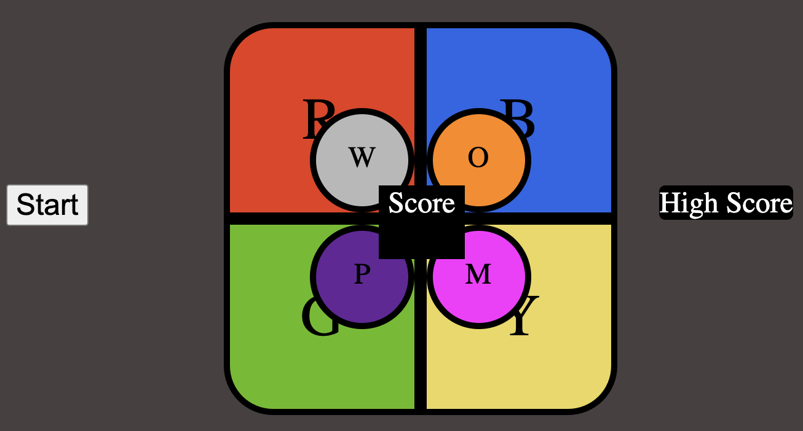

I had a few major hurdles to overcome in order to get the game to work properly.
1. A lot of my testing went wrong in the beginning becuase I needed to make sure that my strings were exactly the same. At first I was comparing them wrong but eventually found the bug and fixed it.
2. I needed to find a way to create divs and place them in the correct spot. I did a lot of research to find out how to resize divs and position them with css and not have to use flexbox or grid to sacrifice functionality.
3. The setTimeout function in Javascript and ensuring that the timings work is very tricky. I had to do a lot of testing to ensure that they worked and that the scopes of each functions lined up and were timed well.
4. I had never used audio files in html before, but learned how to because of this project.
5. Actually figuring out the logic of the game was a challenge at first but pseudocoding it helped me to understand what needed to happen at each step of the way.